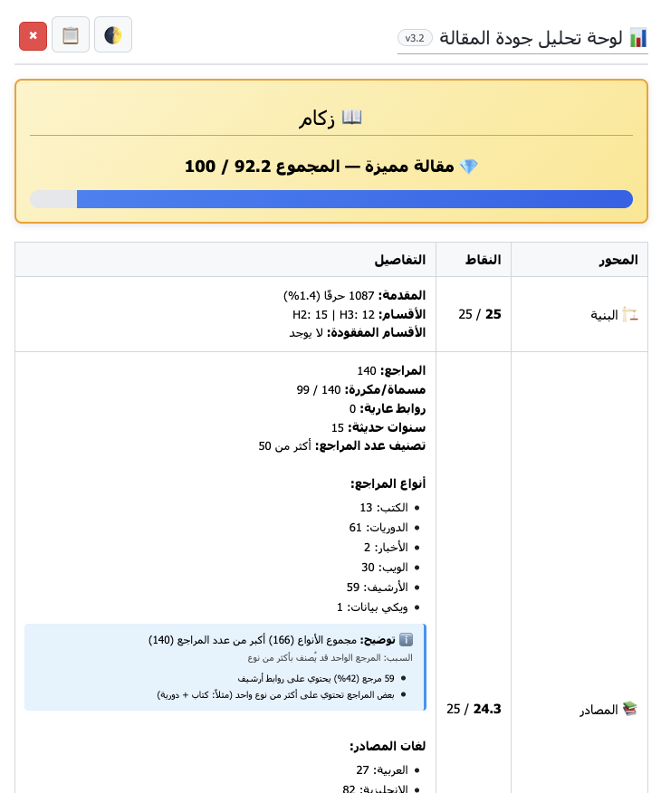
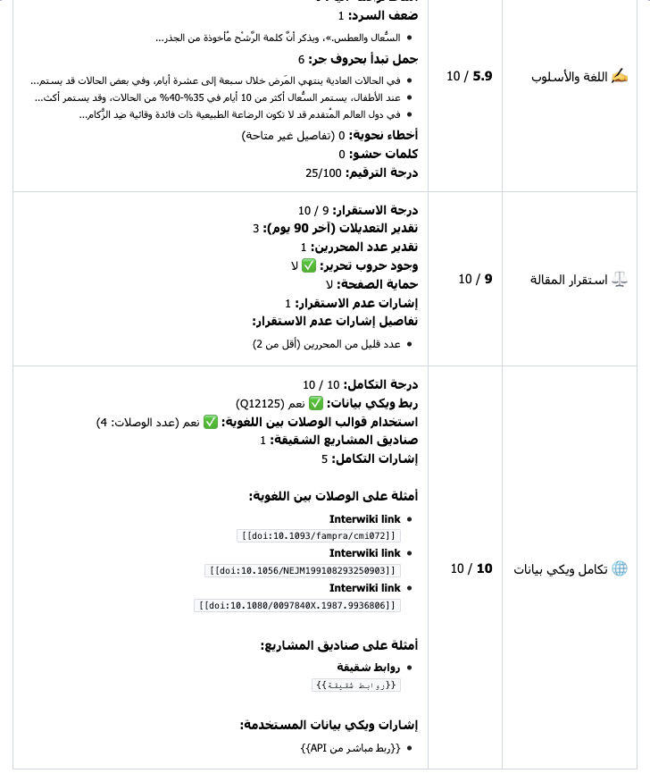
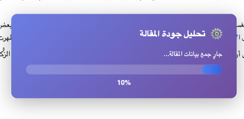

# QUM (Quality Ultra-Max) — Arabic Wikipedia Article Quality Analyzer

QUM is a JavaScript tool (MediaWiki gadget/user script) for analyzing the quality of Arabic Wikipedia articles.
It evaluates multiple dimensions (structure, references, links, media, maintenance, and language) and renders an in-page interactive report to help editors improve articles.
> Target audience: Arabic Wikipedia editors, reviewers, and patrollers.

> **Disclaimer:** This is an **unofficial** community tool. It is **not** affiliated with or endorsed by the Wikimedia Foundation.  
> It is provided “as is” and should be reviewed before enabling as a gadget.
> 

## Features
- MediaWiki Action API–based architecture (no fragile DOM scraping)
- Deep structure analysis (lead/sections/coverage signals)
- Reference analysis (counts, types, quality signals, missing/incomplete refs)
- Link analysis (internal links, red links, density)
- Media analysis (informative images, infobox media, non-free detection signals)
- Maintenance analysis (templates/categories signals)
- Language checks (heuristics + community rules where available)
- Optional analyzers: revision stability & Wikidata integration

## Screenshots

### Panel Overview


### Detailed Scores & Notes


### Progress Indicator


## Project Structure
```
MediaWiki:QUM/
├─ core/
│  ├─ dataFetcher.js
│  ├─ articleModel.js
│  └─ scoringEngine.js
├─ analyzers/
│  ├─ structureAnalyzer.js
│  ├─ referenceAnalyzer.js
│  ├─ linkAnalyzer.js
│  ├─ mediaAnalyzer.js
│  ├─ languageAnalyzer.js
│  ├─ grammarAnalyzer.js
│  ├─ maintenanceAnalyzer.js
│  ├─ revisionAnalyzer.js
│  └─ wikidataIntegrationAnalyzer.js
├─ ui/
│  └─ panelRenderer.js
└─ main.js
```

## How It Works
1. **Loader** fetches core modules first, then analyzers (optional), then UI and main orchestrator.
2. **DataFetcher** gathers page data via the MediaWiki API (parse, revisions, pageprops, etc.).
3. **Analyzers** compute per-dimension results.
4. **ScoringEngine** aggregates weighted scores into a final 0–100 score and quality level.
5. **PanelRenderer** displays the results inside the page.

## Installation (Local Development)
This repository mirrors a MediaWiki gadget layout. To test locally:
- Serve files with any static server.
- Ensure `mw`, `mw.Api`, and `mw.loader` exist (i.e., run inside a MediaWiki environment).
- Map the loader to your wiki pages (e.g., `MediaWiki:Gadget-QUM.js` or a user script).

## MediaWiki Deployment Notes
- Core/UI files should be treated as **critical** (fail fast if missing).
- Analyzer files can be **optional** (tool should still run without them).
- Prefer deploying under `MediaWiki:` namespace (or ResourceLoader modules) for stability.

## Compatibility
- Designed for Arabic Wikipedia and MediaWiki environments.
- Works in main namespace and user sandbox/draft pages (depending on orchestrator rules).

## Version
- Current: **v3.2**

## License
MIT License

Copyright (c) [2025] [Maher]

Permission is hereby granted, free of charge, to any person obtaining a copy
of this software and associated documentation files (the "Software"), to deal
in the Software without restriction, including without limitation the rights
to use, copy, modify, merge, publish, distribute, sublicense, and/or sell
copies of the Software, and to permit persons to whom the Software is
furnished to do so, subject to the following conditions:

The above copyright notice and this permission notice shall be included in all
copies or substantial portions of the Software.

THE SOFTWARE IS PROVIDED "AS IS", WITHOUT WARRANTY OF ANY KIND, EXPRESS OR
IMPLIED, INCLUDING BUT NOT LIMITED TO THE WARRANTIES OF MERCHANTABILITY,
FITNESS FOR A PARTICULAR PURPOSE AND NONINFRINGEMENT. IN NO EVENT SHALL THE
AUTHORS OR COPYRIGHT HOLDERS BE LIABLE FOR ANY CLAIM, DAMAGES OR OTHER
LIABILITY, WHETHER IN AN ACTION OF CONTRACT, TORT OR OTHERWISE, ARISING FROM,
OUT OF OR IN CONNECTION WITH THE SOFTWARE OR THE USE OR OTHER DEALINGS IN THE
SOFTWARE.
